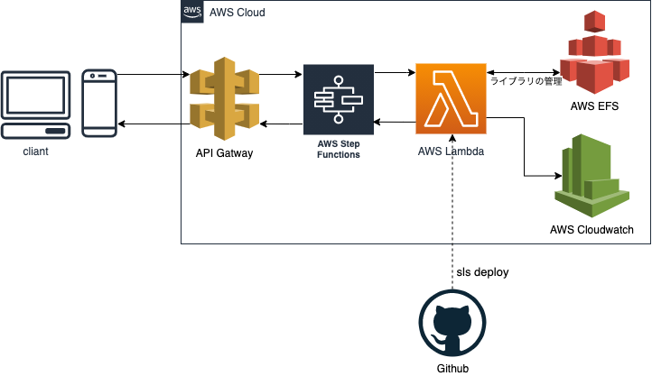

# クソリプ度を測るやつ
## 概要
Twitterでくるリプライのクソリプ度を画像のように0~1で数値化するBot


Bert(深層学習)でリプライをベクトル化してクソリプかどうかを判別

## 使い方
エンドポイント：https://2xa3k3mfyb.execute-api.us-east-2.amazonaws.com/dev/kusoripu-bert-master-api

リクエストボディにキューをtextで指定して，リクエストを送る

例えば
```python:example.py
url = "https://2xa3k3mfyb.execute-api.us-east-2.amazonaws.com/dev/kusoripu-bert-master-api"
param = {'text': sentence}
res = requests.post(url, data=json.dumps(param))
```

## 作った理由
誹謗中傷などのクソリプが原因で自殺する人や心を病んでしまう人が社会問題となっている中で，そのような人たちを救いたいと思ったから．

## 工夫した点
クソリプを防ぐ様々なアプリが開発されれば，もっと社会はよくなると思ったので，クソリプ計算をAPI化した．

## 使用技術
Bert(深層学習モデル)，PyTorch(深層学習ライブラリ)，AWS lambda(インフラ)，serverless framework，github actions
## インフラ構成図


## 今後の展望
lambdaで深層学習をするのは無理があるので，AWS ECSでAPIを作りたい